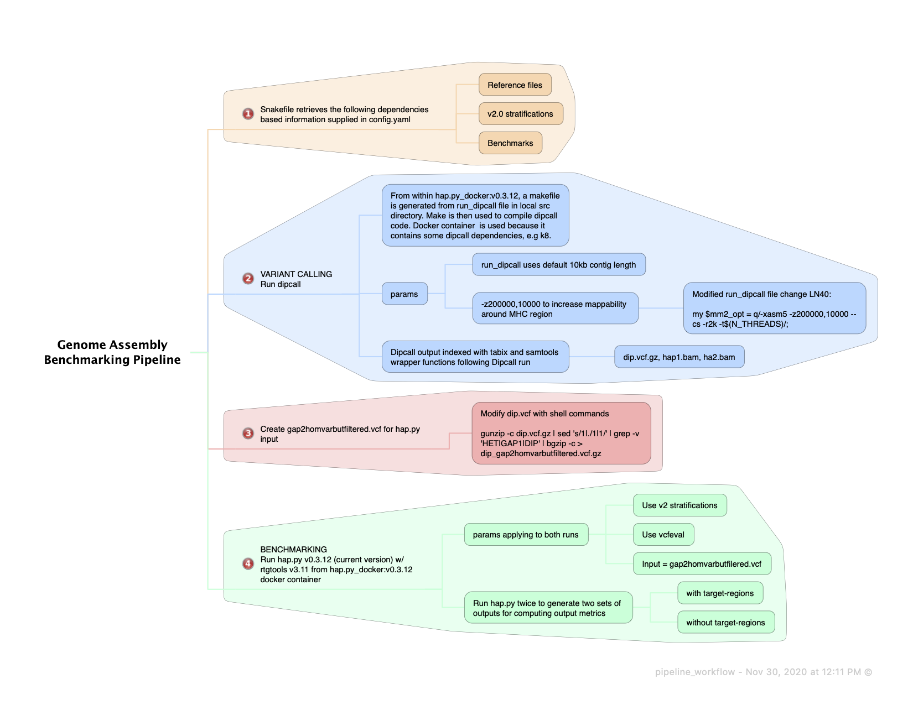

GENERAL INFORMATION
-------------------
The GIAB Assembly Benchmarking Pipeline (GABP) provides a Snakemake pipeline for benchmarking genome assemblies using Dipcall for variant calling and hap.py for benchmarking against a GIAB benchmark or user-defined benchmark set. 

-------------------
Pipeline Workflow
-------------------
The figure below generally describes the steps in the pipeline.  

-------------------
Dependencies
-------------------
- Snakemake v5.18.0 or later (pipeline developed with v5.18.0) 
- Docker and docker container `docker://jmcdani20/hap.py:v0.3.12`
- Dipcall found in `src/` directory (this will be downloaded when repo is cloned)
- bgzip
- wget

-------------------
Getting Started
-------------------
1. Clone workflow into working directory\
`git https://github.com/usnistgov/giab-asm-benchmarking.git path/to/workdir`\
`cd path/to/workdir`

2. Adjust user inputs as required (see "Pipeline Inputs")

3. Execute workflow from within working directory.\
`snakemake -n --use-conda --verbose --reason -k --cores <user defined>`

4. Upon completion of the pipeline a report of configuration and DAG of workflow can be produced by running the following from the working directory.\
`snakemake --report report_name.html`

-------------------
Disclaimer and Development Notes
-------------------
The pipeline was generated for internal use and is still a work-in-progress.  The pipeline was generated and run on a MacBook Pro laptop within a snakemake Conda environment. Note running pipeline command with `--cores` > 1 led to issues with hap.py.  Moreover, hap.py sometimes required significant memory allocation, 20 - 50 GB, for the assemblies I was working with. It might be necessary to adjust your Docker resources for your assemblies.

-------------------
Pipeline Inputs and Outputs
-------------------
The pipeline uses the Snakemake suggested directory structure [https://snakemake.readthedocs.io/en/stable/snakefiles/deployment.html](url), upon cloning the repository your working directory should have the appropriate structure.

### Inputs
The following user inputs are required before execution of the pipeline

**`config/config.yaml`**\
Users must adjust the following fields and save the file.  Example requirements can be found in the`config.yaml`
- "assemblies", path to sample.tsv
- "docker_container",  name given to docker container on local machine
- "gender"
- "reference"
- "benchmark_version",  benchmark version name (this will be used in hap.py output file names)
- paths to benchmarks (vcf.gz, vcf.gz.tbi, bed.gz, bed.gz.tbi). config.yaml contains paths for the various GRCh37 and GRCh38 v4.1 benchmarks, user must input the path they wish to use. 

**`config/samples.tsv`**\
A separate sample file is used to capture assembly information. Multiple assemblies can be listed for batch benchmarking runs.  It is important to note that pipeline will use the same inputs from the `config.yaml` for all assemblies.  User must adjust tab delimted file `samples.tsv` with the following sample fields. 
- "prefix" (assembly name)  -- this will be prepended to output filenames
- path to "paternal_haplotype" and "maternal_haplotype" FASTAs
	- if assembly is haploid fill in same information for both haplotype fields

### Outputs
The pipeline requires various resource files for variant calling and benchmarking. The pipelie will retrieve the appropriate resource files based on reference defined in the`config.yaml` and add the appropropriate directories and files when the pipeline is exectured. Below are the directories and folder you can expect to be generated 
- `resources/references/<reference_chosen_by_user.fa>`
- `resources/stratifications/<chosen_reference>/<v2_stratification_directories_and_files>`
- `resources/benchmark/<chosen_benchmark_files>`

Results will be output to `results/` directory in the working directory. 
- `results/dipcall/<assembly_prefix_name>/<dipcall_output_files>`
- `results/happy/nontargeted/<hap.py_output_files>`
- `results/happy/targeted/<hap.py_output_files>`

-------------------
Tool Information
-------------------
Additional information for tools utilized by the pipeline.  

**Docker image**\
`jmcdani20/hap.py:v0.3.12` was built from hap.py v0.3.12 source code: [https://github.com/Illumina/hap.py/releases](url). This image also contains rtgtools v3.11.

**Dipcall**\
Dipcall source code retrieved following instructions in Heng Li's Dipcall GitHub repository [https://github.com/lh3/dipcall](url). 
- uses docker container for binaries provided with dipcall.
- Dipcall file LN 40 modified `(my $mm2_opt = q/-xasm5 -z200000,10000 --cs -r2k -t$(N_THREADS)/;)` 
      for better mapping to MHC, all other parameters are original default parameters for Dipcall.
      More information on Dipcall modification can be found here[https://github.com/NCBI-Hackathons/TheHumanPangenome/tree/master/MHC/benchmark_variant_callset/MHCv1.0/assembly
](url)
- Dipcall hap1.bam, hap2.bam and dip.vcf.gz are indexed after Dipcall has run

**hap.py**\
Information on hap.py benhcmarking tool can be found at [https://github.com/Illumina/hap.py](url)
- hap.py input uses modified dip.vcf --> dip.gap2homvarbutfiltered.vcf.gz
- hap.py will run twice, with (dip.bed) and without target-regions
- utilizes vcfeval for comparing complex variants

-------------------
Pipeline Limitations
-------------------
- While several assemblies can be specified in samples.tsv, variant calling and benchmarking
      can only be done for single reference, gender and benchmarks. 
- requires user to input FTP paths for benchmarks.  While this allows for users to use any
      benchmark this could leave room for input error. Paths are available in config.yaml for
      latest GIAB benchmarks
- default is v2.0 stratifications
- uses docker which requires root access
- currently does not incorporate R analysis, eventually have this be part of snakemake report
- User must have wget and bgzip, possibly make conda environments for these

